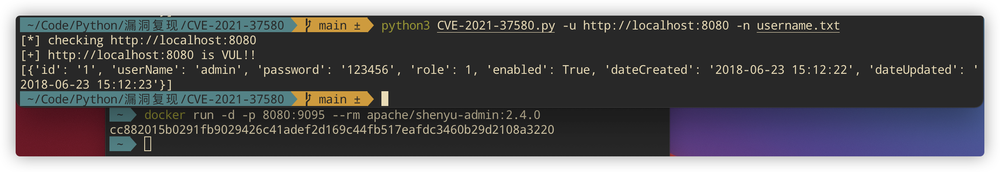
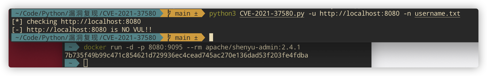
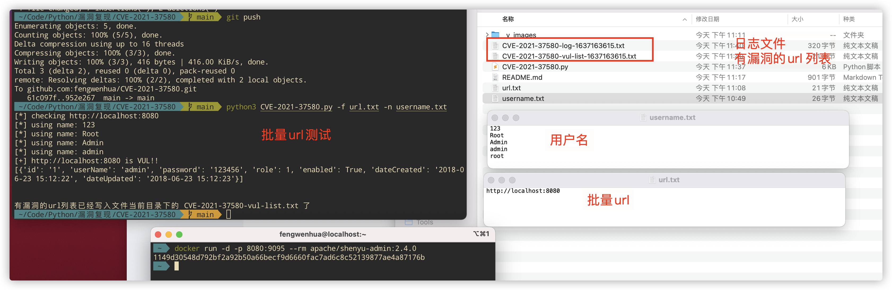

# CVE-2021-37580

>  CVE-2021-37580 的 poc

## 0x00 漏洞原理

漏洞原理：[# Apache ShenYu Admin bypass JWT authentication CVE-2021-37580](https://articles.zsxq.com/id_crk7w2w1wjwa.html)

## 0x01 单个url

```bash
Usage: python3 CVE-2021-37580.py -u url -n username.txt
```

`shenyu-admin-2.4.0`的，有漏洞的如下：



`shenyu-admin-2.4.1`的，没有漏洞的如下：



## 0x02 批量url检测

```bash
Usage: python3 CVE-2021-37580.py -f url.txt -n username.txt
```



## 0x03 脚本报错

如果脚本运行报错:

```
AttributeError: module 'jwt' has no attribute 'encode'
```

执行如下命令：

```bash
python3 -m pip uninstall jwt
python3 -m pip uninstall pyjwt
python3 -m pip install pyjwt==1.5.3 --user
```
